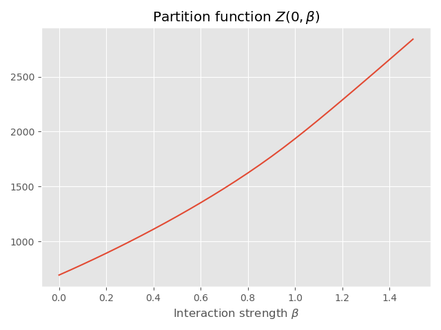

# Probabilistic Graphical Models

Coursework for the class [Introduction to graphical models](http://helios.mi.parisdescartes.fr/~platouch/mva/Introduction%20to%20Probabilistic%20Graphical%20Models%20-%20MVA.html) of the Master MVA.

This repo holds my code and report for the homeworks.

